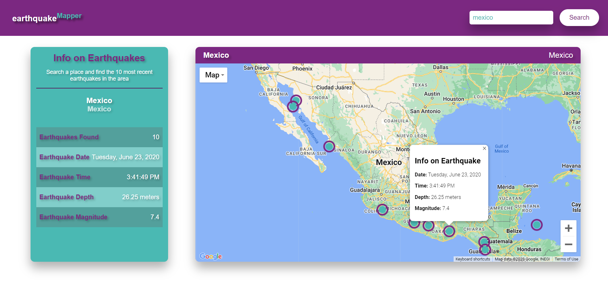

<!-- Improved compatibility of back to top link: See: https://github.com/othneildrew/Best-README-Template/pull/73 -->
<a name="readme-top"></a>
<!--
*** Thanks for checking out the Best-README-Template. If you have a suggestion
*** that would make this better, please fork the repo and create a pull request
*** or simply open an issue with the tag "enhancement".
*** Don't forget to give the project a star!
*** Thanks again! Now go create something AMAZING! :D
-->


<!-- PROJECT SHIELDS -->
<!--
*** I'm using markdown "reference style" links for readability.
*** Reference links are enclosed in brackets [ ] instead of parentheses ( ).
*** See the bottom of this document for the declaration of the reference variables
*** for contributors-url, forks-url, etc. This is an optional, concise syntax you may use.
*** https://www.markdownguide.org/basic-syntax/#reference-style-links
-->
[![Portfolio][moreinfo-shield]][moreinfo-url]
[![LinkedIn][linkedin-shield]][linkedin-url]


<!-- PROJECT LOGO -->
<br />
<div align="center">
  <a href="https://github.com/empobla/earthquakeMapper">
    
  </a>

<h3 align="center">earthquakeMapper</h3>

  <p align="center">
    A website that plots in Google Maps recent earthquakes of a place the user looks up using GeoNames Recent Earthquakes WebService.
    <br />
    <br />
  </p>
</div>


<!-- TABLE OF CONTENTS -->
<details>
  <summary>Table of Contents</summary>
  <ol>
    <li>
      <a href="#about-the-project">About The Project</a>
      <ul>
        <li><a href="#built-with">Built With</a></li>
      </ul>
    </li>
    <li><a href="#abilities-mastered">Abilities Mastered</a></li>
    <li><a href="#dependency-list">Dependency List</a></li>
    <li>
      <a href="#getting-started">Getting Started</a>
      <ul>
        <li><a href="#prerequisites">Prerequisites</a></li>
        <li><a href="#installation">Installation</a></li>
      </ul>
    </li>
    <li><a href="#usage">Usage</a></li>
    <li><a href="#license">License</a></li>
    <li><a href="#contact">Contact</a></li>
    <li><a href="#acknowledgments">Acknowledgments</a></li>
  </ol>
</details>


<!-- ABOUT THE PROJECT -->
## About The Project

[![Product Name Screen Shot][product-screenshot]](https://emilioppv.com/projects#earthquakemapper)

This project is a website that combines the use of both Google Maps API and GeoNames Recent Earthquakes API to show the user the biggest, most recent earthquakes that have occurred in a place that the user looks up.

The objective of this project was mainly to improve my knowledge and use of REST APIs and to be able to create an interactive website that, through the use of APIs, can provide useful information for users in a real-world scenario.

<p align="right">(<a href="#readme-top">back to top</a>)</p>


### Built With

[![Express][Express.js]][Express-url]
[![Pug][Pug.js]][Pug-url]
[![Node][Node.js]][Node-url]
[![Heroku][Heroku]][Heroku-url]

<p align="right">(<a href="#readme-top">back to top</a>)</p>


<!-- ABILITIES MASTERED -->
## Abilities Mastered

* Use of GeoNames API
* Use of GoogleMaps JavaScript and Places API

<p align="right">(<a href="#readme-top">back to top</a>)</p>


<!-- DEPENDENCY LIST -->
## Dependency List

* **@googlemaps/google-maps-service-js**: For using Google Maps API.
* **Axios**: For making requests to GeoNames.
* **Body-Parser**: For limiting the request body payload the user can submit.
* **Compression**: For compressing express' requests.
* **Dotenv**: For handling in-app environment variables such as API keys.
* **Express.js**: For handling the server logic.
* **Express-Rate-Limit**: For limiting the amount of requests per window of time a user can make.
* **Helmet**: For applying server security policies such as CORS.
* **Node.js**: Framework used to build application.
* **Pug**: Templating language for frontend SSR.

<p align="right">(<a href="#readme-top">back to top</a>)</p>


<!-- GETTING STARTED -->
## Getting Started

To get a local copy up and running follow these simple example steps.

### Prerequisites

This project requires two Google API Keys (one for backend queries and one for frontend map rendering) and your GeoName's username.

### Installation

1. Clone the repo
   ```sh
   git clone https://github.com/empobla/earthquakeMapper.git
   ```
2. Install NPM packages
   ```sh
   npm install
   ```
3. In the project's directory, create a `.env` file with the following keys:
   ```text
   GEONAMES_USERNAME=<GEONAMES_USERNAME>

   GOOGLE_API_BACK=<GOOGLE_SERVER_API_KEY>
   GOOGLE_API_FRONT=<GOOGLE_CLIENT_API_KEY>
   ```
   _Note: Replace everything in between `<>` with your actual keys._

4. Start the server in development mode!
   ```sh
   npm run devstart
   ```

<p align="right">(<a href="#readme-top">back to top</a>)</p>


<!-- USAGE EXAMPLES -->
## Usage

earthquakeMapper will display the top 10 earthquakes in the last 12 months found in the world initially. If any earthquake point is selected, it will display it's date, time, depth, and magnitude as well. In addition, you can search for places, prompting earthquakeMapper to update it's map and show you the top 10 strongest earthquakes on the place you selected in the last 12 months.



<p align="right">(<a href="#readme-top">back to top</a>)</p>


<!-- LICENSE -->
## License

This project is property of Emilio Popovits Blake. All rights are reserved. Modification or redistribution of this code must have _explicit_ consent from the owner.

<p align="right">(<a href="#readme-top">back to top</a>)</p>


<!-- CONTACT -->
## Contact

Emilio Popovits Blake - [Contact](https://emilioppv.com/contact)

Project Link: [https://github.com/empobla/earthquakeMapper](https://github.com/empobla/earthquakeMapper)

<p align="right">(<a href="#readme-top">back to top</a>)</p>


<!-- ACKNOWLEDGMENTS -->
## Acknowledgments

* [GeoNames Earthquakes API](http://www.geonames.org/export/JSON-webservices.html)
* [Google Maps API](https://developers.google.com/maps)

<p align="right">(<a href="#readme-top">back to top</a>)</p>


<!-- MARKDOWN LINKS & IMAGES -->
<!-- https://www.markdownguide.org/basic-syntax/#reference-style-links -->
[linkedin-shield]: https://img.shields.io/badge/-LinkedIn-black.svg?style=for-the-badge&logo=linkedin&colorB=555
[linkedin-url]: https://linkedin.com/in/emilio-popovits

[product-screenshot]: README/images/thumbnail.png

[Express.js]: https://img.shields.io/badge/express-000000?style=for-the-badge&logo=express&logoColor=ffffff
[Express-url]: https://expressjs.com/
[Pug.js]: https://img.shields.io/badge/pug.js-a86454?style=for-the-badge&logo=pug&logoColor=000000
[Pug-url]: https://pugjs.org
[Node.js]: https://img.shields.io/badge/node.js-090c15?style=for-the-badge&logo=nodedotjs&logoColor=339933
[Node-url]: https://nodejs.org
[Heroku]: https://img.shields.io/badge/heroku-430098?style=for-the-badge&logo=heroku&logoColor=ffffff
[Heroku-url]: https://www.heroku.com/

[moreinfo-url]: https://emilioppv.com/projects#earthquakemapper
[moreinfo-shield]: https://img.shields.io/badge/more%20info-1b1f24?style=for-the-badge&logo=data:image/png;base64,iVBORw0KGgoAAAANSUhEUgAAAA4AAAAOCAMAAAAolt3jAAAABGdBTUEAALGPC/xhBQAAACBjSFJNAAB6JgAAgIQAAPoAAACA6AAAdTAAAOpgAAA6mAAAF3CculE8AAAApVBMVEUbHyQbHyQbHyRnam2sra+vsbKys7Wsrq+goqQwNDgaHyQaIilbXWGChIZMT1OYmpwYQFoaICYXRF8WUHQZLjwvMzdwcnaztLZ1d3pcX2IaICUXTG0WUHMXS2sXSGcWT3MaKjcpLTFVWFyFh4lTVllvcnWpqqwYOEwZM0QXTW4XTnAaJS8lKS3IycoYPlYaIyt4e36rra60tba5urutr7BQU1cAAAB8HBV3AAAAAnRSTlOR/KrCyFQAAAABYktHRDZHv4jRAAAACXBIWXMAAAsTAAALEwEAmpwYAAAAB3RJTUUH5wEZCiUZVutNzgAAAGpJREFUCNdjYGBkggNGBmQeiM+EAjC5zCwsrGzsHJwQLhc3ExMPLxMfP5OAIBODkLCIqBi/uASHpJS0jCyDnLyCopIyh4qqmrqGphYDk5Q2WLGOrh63PsgoA0NDI2NDE1PsFqFw0RyJ6gUAuK4HVipJCoQAAAAuelRYdGRhdGU6Y3JlYXRlAAAImTMyMDLWNTDUNTINMTSwMja3MjLVNjCwMjAAAEFRBQlQZi6pAAAALnpUWHRkYXRlOm1vZGlmeQAACJkzMjAy1jUw1DUyDTE0sDI2tzIy1TYwsDIwAABBUQUJeVmGIQAAAABJRU5ErkJggg==